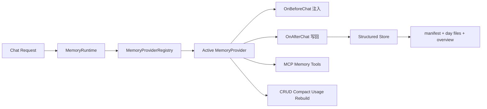

# Nion Memory V3 一次性重构蓝图（One-shot Cutover）

## 1. 决策摘要
- 决策 D1：Nion 从 `Memory V2`（单体 memory.json 链路）一次性切主到 `Provider 化 Memory V3`。
- 决策 D2：数据从 `memory.json` 迁移到结构化存储（manifest + day-file + overview），保留短期双读窗口，不做长期双写。
- 决策 D3：统一后端 `/api/memory/*` 语义并新增 provider 管理面。
- 决策 D4：前端 Memory Settings 合并为“展示 + 控制 + provider 配置”，移除双入口和未接线配置。
- 决策 D5：以“可回滚”作为上线前置条件：任何 P0 触发立即回退到 V2。

## 1.1 执行前提
- GitNexus 索引已更新且与当前提交一致（`a6f07d5`）。
- 以当前工作区为基线（含现有 memory 相关改动），不做历史改动回滚。
- 本文术语、风险分级与前两份研究文档保持一致。

## 2. 目标架构



### 2.1 新增后端接口族（强制）

```python
class MemoryProvider(Protocol):
    def type(self) -> str: ...
    def on_before_chat(self, req: BeforeChatRequest) -> BeforeChatResult | None: ...
    def on_after_chat(self, req: AfterChatRequest) -> None: ...
    def list_tools(self, session: ToolSessionContext) -> list[ToolDescriptor]: ...
    def call_tool(self, session: ToolSessionContext, tool_name: str, arguments: dict) -> dict: ...
    def add(self, req: AddRequest) -> SearchResponse: ...
    def search(self, req: SearchRequest) -> SearchResponse: ...
    def get_all(self, req: GetAllRequest) -> SearchResponse: ...
    def update(self, req: UpdateRequest) -> MemoryItem: ...
    def delete(self, memory_id: str) -> DeleteResponse: ...
    def delete_batch(self, memory_ids: list[str]) -> DeleteResponse: ...
    def delete_all(self, req: DeleteAllRequest) -> DeleteResponse: ...
    def compact(self, req: CompactRequest) -> CompactResult: ...
    def usage(self, req: UsageRequest) -> UsageResponse: ...
    def rebuild(self, req: RebuildRequest) -> RebuildResult: ...
```

```python
class MemoryProviderRegistry:
    def register_factory(self, provider_type: str, factory: ProviderFactory) -> None: ...
    def instantiate(self, provider_id: str, provider_type: str, config: dict) -> MemoryProvider: ...
    def get(self, provider_id: str) -> MemoryProvider: ...
    def remove(self, provider_id: str) -> None: ...
    def set_default(self, provider_id: str) -> None: ...
    def default(self) -> MemoryProvider: ...
```

```python
class MemoryRuntime:
    def resolve_provider(self, bot_id: str, thread_id: str | None = None) -> MemoryProvider: ...
    def inject_context(self, req: BeforeChatRequest) -> str: ...
    def persist_round(self, req: AfterChatRequest) -> None: ...
    def enforce_session_policy(self, runtime_context: dict) -> MemoryPolicy: ...
```

### 2.2 V3 默认 Provider
- `StructuredFsProvider`（主）：结构化文件存储，承担检索/写回/compact/usage/rebuild。
- `MemoryJsonLegacyProvider`（兼容）：仅用于迁移窗口与回滚，不再作为主路径。

## 3. 数据模型与迁移目标

### 3.1 迁移源
- 全局：`{base_dir}/memory.json`
- per-agent：`{base_dir}/agents/{agent}/memory.json`

来源证据：
- `backend/src/config/paths.py:57-77`
- `backend/src/agents/memory/updater.py:19-38`

### 3.2 迁移目标（建议目录）
```
{base_dir}/memory_v3/
  index/manifest.json
  memory/YYYY-MM-DD.md
  MEMORY.md
  snapshots/memory-v2-<timestamp>/
```

### 3.3 迁移规则
- `user/history` summary -> `memory` entries（保留 section 标签到 metadata）。
- `facts[]` -> 独立 entries，保留 `confidence/source/category`。
- `agent memory` 按 `scope=agent:{name}` 与 `scope=global` 分区。
- 生成稳定 `memory_id`（建议 `sha256(scope + content + created_at)`），确保幂等。
- 迁移脚本重复执行安全：已存在 `memory_id` 直接跳过。

## 4. 后端 API 重构（统一 `/api/memory/*`）

### 4.1 保留并升级
- `GET /api/memory` -> 统一 memory 聚合视图（provider-aware）
- `GET /api/memory/status` -> provider 状态 + policy + 存储健康

### 4.2 新增能力端点
- `GET /api/memory/usage`
- `POST /api/memory/compact`
- `POST /api/memory/rebuild`
- `GET /api/memory/providers`
- `POST /api/memory/providers`
- `GET /api/memory/providers/{provider_id}`
- `PUT /api/memory/providers/{provider_id}`
- `DELETE /api/memory/providers/{provider_id}`
- `POST /api/memory/providers/{provider_id}/default`

### 4.3 兼容策略
- 兼容窗口内旧端点语义不变，但返回 `deprecation` 字段。
- 窗口结束后移除 `reload-only` 旧心智，全部走 provider runtime。

## 5. 前端契约改造

### 5.1 MemorySettingsPage 合并升级
- 从“只读 markdown 展示”升级为：
  1. 当前 provider 状态展示
  2. provider 切换/配置
  3. usage/compact/rebuild 操作入口
  4. 记忆可视化列表（可筛选 scope/category）

### 5.2 消除双入口
- 取消“Memory 页面只读 + 配置页 MemorySection（未接线）”割裂。
- 将 memory 相关配置统一收敛到 MemorySettingsPage。

### 5.3 临时会话端到端可验证
- 明确 `temporary_chat + memory_write=false`：
  - 前端继续透传 `memory_read/memory_write/session_mode`
  - 后端 `MemoryRuntime.enforce_session_policy()` 强制执行：`memory_write=false` 时禁止 `OnAfterChat`

现状证据（必须修复）：
- `frontend/src/app/workspace/chats/[thread_id]/page.tsx:368-373,452-457`
- `backend/src/agents/thread_state.py:84-97`
- `backend/src/agents/middlewares/runtime_profile_middleware.py:11-15,55-57`

## 6. 一次性 Cutover Runbook

### 6.1 阶段 A：冻结前准备（T-7 ~ T-1）
1. 合入 V3 代码与迁移脚本，默认 `memory_v3_enabled=false`。
2. 完成全量预演（含迁移、失败注入、回滚）。
3. 生成迁移前快照：`memory.json`、`agents/*/memory.json`、配置库版本。

### 6.2 阶段 B：冻结旧写入（T0）
1. 发布开关：`memory_v2_write_enabled=false`（旧链路只读）。
2. 保留旧注入仅读（防止瞬时上下文真空）。
3. 记录冻结时刻 `cutover_at`（用于增量校验）。

### 6.3 阶段 C：全量迁移（T0）
1. 执行 `memory_v2_to_v3_migrate`：global + per-agent 全量导入。
2. 迁移后执行一致性校验：
   - entry 数量
   - 关键字段抽样（content/category/confidence/source）
   - manifest/overview 完整性

### 6.4 阶段 D：双读短窗（T0 ~ T0+24h）
1. 读策略：`read(V3) -> fallback(V2)`。
2. 写策略：仅 V3 写入（禁止 V2 回写，避免分叉）。
3. 指标门禁：fallback 命中率、V3 读取失败率、注入空结果率。

### 6.5 阶段 E：切主与清理（T0+24h）
1. 关闭 V2 注入与 V2 读取 fallback。
2. 下线 V2 middleware/queue/updater 主路径（保留最小回滚挂点到 T0+7d）。
3. 清理前端双入口与死配置字段。

## 7. 回滚机制（必须可演练）

### 7.1 失败触发条件
- P0-1：迁移任务失败或校验不通过。
- P0-2：V3 读取失败率 > 1% 且持续 5 分钟。
- P0-3：`temporary_chat` 出现记忆写入（策略破坏）。
- P0-4：核心回归用例失败（上传过滤、custom agent 隔离、API 兼容）。

### 7.2 回滚步骤
1. 立即切换：`memory_v3_enabled=false`，恢复 `memory_v2_write_enabled=true`。
2. 恢复注入链路：`_get_memory_context` 回到 V2 数据源。
3. 用快照恢复 V2 文件：`memory.json` 与 `agents/*/memory.json`。
4. 冻结 V3 写入并保存现场（用于事后比对）。
5. 重新执行健康检查 + 端到端回归，确认系统恢复。

### 7.3 数据恢复路径
- 以迁移前快照为主恢复源。
- 迁移窗口内新增数据从 V3 变更日志回放到 V2（可选，按事故等级决定）。

## 8. 测试矩阵（写入重构蓝图）

### 8.1 单元测试
- Provider hook：`OnBeforeChat/OnAfterChat` 行为、异常兜底。
- 权限与作用域：bot/global/agent 隔离。
- 去重与解析：memory_id 稳定性、manifest 解析、day-file 解析。
- 迁移幂等：重复执行不重复写入。

### 8.2 集成测试
- 完整 chat 回合：检索注入 -> 模型回复 -> 写回闭环。
- `temporary_chat + memory_write=false`：确保不落盘。
- Provider 切换后：新 provider 立即生效（registry 生命周期联动验证）。

### 8.3 回归测试
- 上传过滤：`uploaded_files` 不入长期记忆。
- custom agent 记忆隔离：global vs per-agent 数据边界。
- memory API 兼容：旧端点兼容窗口行为。

### 8.4 迁移/回滚测试
- 迁移重复执行安全。
- 迁移中断后可重入。
- 触发回滚后数据一致性可验证。

## 9. 实施顺序（执行清单）
1. 建立 `MemoryProvider/Registry/Runtime` 最小骨架并接入 chat 主链路（只读模式）。
2. 落地 `StructuredFsProvider` 与 `/api/memory/*` 新端点。
3. 接入 provider 管理面，保证 CRUD 与 registry 生命周期同步。
4. 完成迁移脚本、快照脚本、校验脚本。
5. 前端合并设置页并打通临时会话策略验证。
6. 执行 one-shot cutover + 双读短窗 + 切主清理。

## 10. 决策证据索引

| 决策ID | 决策 | 证据来源（文件/行号） | 风险级别 |
|---|---|---|---|
| B-01 | 必须引入 Provider 层 | Nion 现状单体链路：`memory_middleware.py:112-153`, `updater.py:239-303`; Memoh 抽象：`provider.go:9-48` | P1 |
| B-02 | 必须统一 runtime 策略点处理 `memory_write` | 前端透传：`page.tsx:368-373`; 后端未消费：`thread_state.py:84-97` | P0 |
| B-03 | 必须把 provider CRUD 与实例生命周期联动 | Memoh 断点：`memory_providers.go:25-158`, `serve.go:244` | P0 |
| B-04 | 结构化存储选型可行 | Memoh storefs：`storefs/service.go:107-210,271-331,446-455` | P1 |
| B-05 | 需要 `usage/compact/rebuild/provider status` API | Nion 缺口：`gateway/routers/memory.py:75-201`; Memoh 对照：`handlers/memory.go:399-539` | P1 |
| B-06 | 必须做双读短窗而非长期双写 | Nion 当前一致性弱点：`queue.py:56-60,84-130`; 迁移期长期双写会放大分叉风险 | P1 |
| B-07 | 必须内建回滚演练 | Nion 测试缺口：`test_memory_upload_filtering.py` 单点覆盖，缺迁移/回滚闭环 | P1 |

## 11. 完成判定（DoD）
- 三类流量（普通会话、临时会话、custom agent）均通过 V3 闭环。
- `temporary_chat + memory_write=false` 有自动化测试且线上可观测。
- `/api/memory/*` 文档与前端设置页行为一致，无双入口冲突。
- 迁移与回滚在预演环境各成功至少 2 次，产出可复核报告。
