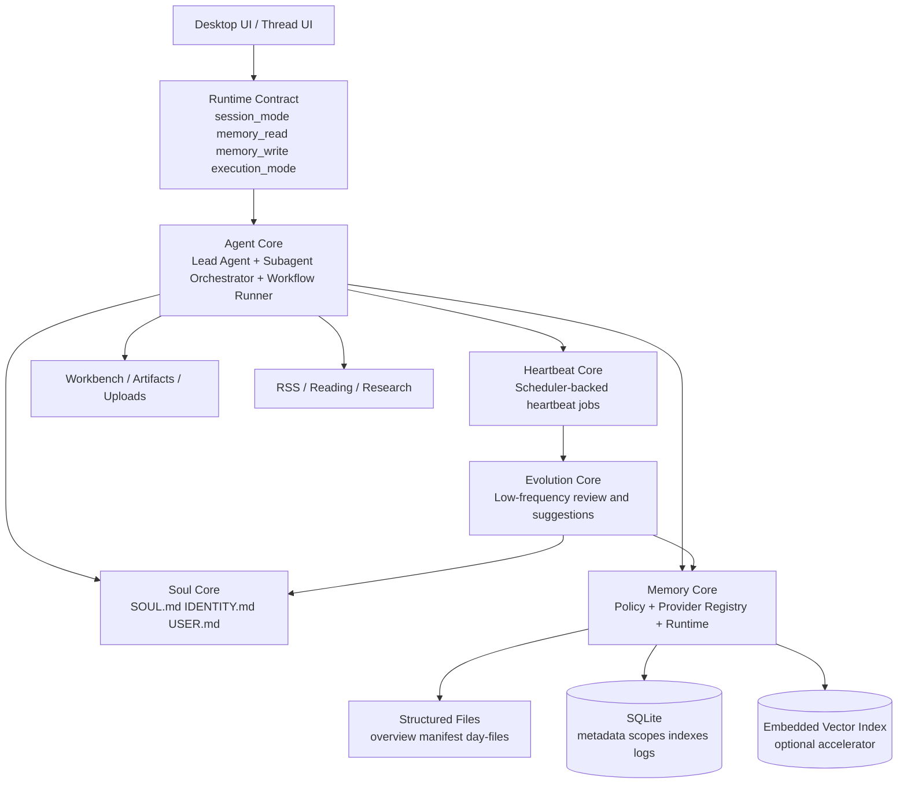

# Nion × Memoh 对标研究与轻量个人助手架构报告（2026-03-09）

- Nion 研究基线：`a6f07d5a8720b45382b1b258720689a2ebd53b96`
- Memoh 对标基线：`36d50738b55f47a420aacf6e42657df38439a6da`
- Memoh 基线仓库：[memohai/Memoh](https://github.com/memohai/Memoh/tree/36d50738b55f47a420aacf6e42657df38439a6da)
- 研究边界：本报告只做架构研究、模块对标、借鉴建议与实施路线，不改运行时代码。
- 设计红线：`单用户`、`桌面端`、`本地优先`、`轻量依赖`、`文件系统 + SQLite + 内嵌向量能力`、`兼容 LangGraph`。

## 执行摘要

1. `Nion` 已经具备一个可工作的个人助手底座：聊天线程、LangGraph 主智能体、子智能体委派、记忆 V2、调度器、RSS、工作台、频道桥接、MCP、配置中心都已落地。
2. `Nion` 当前最大短板不在“没有能力”，而在“能力没有抽象成稳定内核”：典型表现是记忆仍是 V2 单体链路、前后端运行时契约漂移、`soul / heartbeat / evolution` 多为配置和规划、尚未形成闭环。
3. `Memoh` 最值得借鉴的不是它的多租户或容器化部署，而是它把记忆、子智能体、心跳、身份这些能力做成了独立模块，并通过 `settings -> resolver -> provider/runtime -> handlers/MCP` 串成清晰主链路。
4. 对 `Nion` 而言，应该“借接口与边界，不借重型形态”：保留桌面端、本地化、轻依赖原则，把 `Memoh` 的 `MemoryProvider`、结构化文件记忆、Heartbeat 触发/日志、`IDENTITY.md + SOUL.md` 这些思想压缩成适合单用户桌面端的轻量实现。
5. 推荐的演进顺序是：先做 `Memory Core`，再做 `Soul Core`，再把 `scheduler` 升级为 `Heartbeat Core`，最后补 `Evolution Core` 与“有边界”的多智能体增强。不要一开始就做复杂自治社会或容器化多 Bot 平台。

## 一、Nion 当前真实模块地图

### 1.1 模块分层结论

| 模块 | 状态 | 当前实现 | 关键证据 | 主要断点 |
|---|---|---|---|---|
| 聊天线程与主智能体 | 已落地 | LangGraph lead agent + middleware 链路 | `backend/src/agents/lead_agent/agent.py` | 运行时策略字段仍偏少 |
| 子智能体委派 | 已落地 | `SubagentExecutor` + 内建 subagent registry | `backend/src/subagents/executor.py`, `backend/src/subagents/registry.py` | 缺少更强的角色、记忆与任务模板分层 |
| 记忆系统 V2 | 已落地 | `MemoryMiddleware -> Queue -> Updater -> memory.json` | `backend/src/agents/middlewares/memory_middleware.py`, `backend/src/agents/memory/queue.py`, `backend/src/agents/memory/updater.py` | 单体设计、API 偏只读、策略点分散 |
| 调度器 / 工作流 | 已落地 | APScheduler + workflow step agents | `backend/src/scheduler/models.py`, `backend/src/scheduler/runner.py`, `backend/src/scheduler/workflow.py` | 还不是“心跳系统” |
| 线程运行时配置 | 已落地 | `execution_mode / host_workdir / locked` | `backend/src/runtime_profile/repository.py`, `backend/src/agents/middlewares/runtime_profile_middleware.py` | 尚未纳入 `memory_read / memory_write / session_mode` |
| RSS / 阅读助手 | 已落地 | RSS 路由、页面、阅读人设 | `backend/src/gateway/routers/rss.py`, `frontend/src/app/workspace/rss`, `backend/src/agents/souls/reading_assistant.md` | 只在特定场景有灵魂化能力 |
| Workbench / Artifact / Upload | 已落地 | 线程工作台、产物组、上传、工具联动 | `backend/src/gateway/routers/workbench.py`, `backend/src/gateway/routers/artifacts.py`, `backend/src/gateway/routers/uploads.py` | 与长期记忆仍是弱连接 |
| Channels / 外部通道 | 已落地 | DingTalk/Lark 等桥接与授权绑定 | `backend/src/gateway/routers/channels.py`, `backend/src/channels` | 偏平台集成，不是核心个人助手内核 |
| Custom Agent + SOUL | 半落地 | 自定义智能体目录、`config.yaml + SOUL.md` | `backend/src/gateway/routers/agents.py`, `backend/src/config/agents_config.py` | 只有自定义 agent 具备 SOUL 文件形态，缺少统一 Soul Core |
| Heartbeat | 半落地 | 有 scheduler 和前端 heartbeat 文案/事件，但无统一 heartbeat 域模型 | `backend/src/scheduler`, `frontend/src/core/workbench/sdk.ts` | 没有独立心跳任务、日志、策略定义 |
| Evolution / Reflection | 仅规划 | memory config 中有演化字段，文档有规划 | `backend/src/config/memory_config.py`, `docs/MEMORY_SYSTEM_UPGRADE_PLAN.md` | 当前无真实进化执行引擎 |

### 1.2 已落地的核心内核

#### A. Agent Core 已经成型

- `backend/src/agents/lead_agent/agent.py` 已将 `RuntimeProfileMiddleware`、`UploadsMiddleware`、`SandboxMiddleware`、`TitleMiddleware`、`MemoryMiddleware`、`SubagentLimitMiddleware`、`ClarificationMiddleware` 串成主执行链。
- 主智能体已经具备 `plan mode`、子智能体开关、视觉模型分支、工具分组与自定义 agent 配置加载能力。
- 这说明 `Nion` 的问题不是“没有 agent framework”，而是“缺一个稳定的能力内核层，把记忆、灵魂、心跳这些能力纳入统一策略模型”。

#### B. 子智能体能力已经可用

- `backend/src/subagents/executor.py` 已支持子智能体独立 agent 实例、工具过滤、模型继承、超时控制、异步执行、thread/sandbox 透传。
- `backend/src/subagents/registry.py` 与 `backend/src/subagents/builtins` 已提供注册中心与内建配置。
- `backend/src/scheduler/workflow.py` 又提供了面向工作流的“多个 agent step 串并行执行”能力。
- 结论：`Nion` 不需要重新发明多智能体编排，只需要把“何时委派、委派后共享什么、子智能体是否拥有独立记忆/身份”设计清楚。

#### C. 调度器已经是 Heartbeat 的现成底座

- `backend/src/scheduler/models.py` 已定义 `cron / interval / once / event / webhook` 触发器、`workflow / reminder` 模式、执行记录、重试与并发控制。
- `backend/src/gateway/routers/scheduler.py` 已提供任务 CRUD、立即运行、历史、事件派发、Webhook 触发。
- `backend/src/scheduler/workflow.py` 已经能够把步骤型任务委派给不同 agent 执行。
- 结论：后续做 `Heartbeat Core` 时，优先复用现有 scheduler，不应该另起一套定时框架。

### 1.3 当前必须承认的断点

#### A. 记忆系统仍是 V2 单体方案

- 当前真实链路是 `MemoryMiddleware -> MemoryUpdateQueue -> MemoryUpdater -> memory.json`。
- `backend/src/gateway/routers/memory.py` 只有 `/memory`、`/memory/reload`、`/memory/config`、`/memory/status`，更像只读/诊断接口，而不是完整记忆服务面。
- `backend/src/config/memory_config.py` 已承载大量检索、压缩、演化字段，但这些字段并未形成统一 runtime。
- 这会导致“字段很多、感觉很强、但能力边界不清晰”。

#### B. 前后端运行时契约已经漂移

- 前端线程上下文已经定义 `memory_read`、`memory_write`、`session_mode`：`frontend/src/core/threads/types.ts`。
- 临时会话页面已透传 `memory_write: false` 与 `session_mode: "temporary_chat"`：`frontend/src/app/workspace/chats/[thread_id]/page.tsx`。
- 但后端 `ThreadState` 与 `RuntimeProfileMiddleware` 当前只处理 `execution_mode / host_workdir / runtime_profile_locked`：`backend/src/agents/thread_state.py`, `backend/src/agents/middlewares/runtime_profile_middleware.py`。
- 直接结果：临时会话“可读记忆但不写记忆”的业务语义尚未真正被后端统一执行。

#### C. Soul / Evolution 仍是“配置与文案先行”

- `backend/src/config/agents_config.py` 与 `backend/src/gateway/routers/agents.py` 已支持自定义 agent 的 `SOUL.md` 读写。
- `backend/src/config/memory_config.py` 已出现 `evolution_enabled`、`evolution_interval_hours` 等字段。
- 前端设置文案也出现了 `soul`、`evolution`：`frontend/src/components/workspace/settings/configuration/sections/memory-section.tsx`。
- 但当前源码中没有一个真正的 `Soul Core` 或 `Evolution Core` 运行时模块；`backend/src/reflection` 只是类/变量解析工具，不是“反思引擎”。

## 二、Memoh 的真实模块与主链路

### 2.1 需要借鉴的不是整套部署，而是模块化边界

`Memoh` 的产品形态是“多用户、多 Bot、容器化、跨平台消息系统”。这一点与 `Nion` 的单用户桌面端并不一致。但它在内部结构上做对了两件事：

1. 把复杂能力拆成明确域模块，例如 `memory`、`heartbeat`、`schedule`、`identity`、`subagent`、`mcp providers`。
2. 把运行时入口与能力实现对齐，例如 `settings -> resolver -> provider/runtime -> handlers/MCP`，从而避免“前台有按钮、后台没接线”的漂移。

### 2.2 Memoh 的关键模块地图

| 主题 | Memoh 真实模块 | 关键证据 | 对 Nion 的意义 |
|---|---|---|---|
| 设置中心 | Bot settings 持有 `MemoryProviderID`、`HeartbeatEnabled`、`HeartbeatInterval` | `internal/settings/types.go` | 能力选择应落在统一 settings/配置层 |
| 记忆 Provider | `Provider` 抽象了 `OnBeforeChat / OnAfterChat / CRUD / Compact / Usage / MCP` | `internal/memory/provider/provider.go` | 值得直接借鉴 |
| 记忆 Registry / Service | provider type、实例化、默认 provider、服务管理 | `internal/memory/provider/registry.go`, `internal/memory/provider/service.go` | Nion 应建立 registry，不再把记忆写死在单体函数里 |
| 会话记忆接线 | chat resolver 在对话前后调用 provider hook | `internal/conversation/flow/resolver.go` | 记忆应在主链路有统一注入点与写回点 |
| 结构化记忆文件 | `storefs` 使用 `manifest + overview + day-file` | `internal/memory/storefs/service.go` | 非常适合本地桌面端 |
| 记忆服务面 | memory handlers 提供 `search / getall / compact / rebuild / usage` | `internal/handlers/memory.go` | Nion 需要完整记忆 API，而不是仅状态页 |
| 心跳系统 | 独立 `heartbeat` 服务、cron 调度、日志、触发器 | `internal/heartbeat/service.go`, `internal/heartbeat/types.go` | 值得结构借鉴 |
| 调度系统 | 独立 `schedule` 服务、Cron、JWT trigger | `internal/schedule/service.go`, `internal/schedule/types.go` | Nion 已有底座，只需吸收语义层 |
| 身份/灵魂 | `IDENTITY.md`、`SOUL.md`、`HEARTBEAT.md` 模板 | `cmd/mcp/template/IDENTITY.md`, `cmd/mcp/template/SOUL.md`, `cmd/mcp/template/HEARTBEAT.md` | 适合做轻量化人设/身份层 |
| 子智能体 | 有独立 `subagent` 服务、handler、MCP provider、上下文与技能接口 | `internal/subagent`, `internal/handlers/subagent.go`, `internal/mcp/providers/subagent/provider.go` | 值得结构借鉴 |
| MCP 工具域 | memory、schedule、message、browser、subagent 等均有 provider | `internal/mcp/providers/*` | 说明复杂能力要有统一工具暴露面 |

### 2.3 Memoh 记忆主链路值得重点学习

#### A. Settings 决定使用哪个 MemoryProvider

- `internal/settings/types.go` 明确把 `MemoryProviderID` 放入 bot settings。
- 这意味着“记忆后端是谁”是一个一等配置，而不是散落在若干函数里。

#### B. Resolver 在对话前后只认 Provider 抽象

- `internal/conversation/flow/resolver.go` 会通过 `MemoryProviderID` 找到 provider。
- 对话前调用 `OnBeforeChat` 注入记忆上下文，对话后调用 `OnAfterChat` 写回记忆。
- 这条主链路让记忆成为运行时的正式能力，而不是旁路逻辑。

#### C. Provider 同时承担服务面与 MCP 面

- `internal/memory/provider/provider.go` 的接口不只管 chat hook，还覆盖 `Add/Search/GetAll/Update/Delete/DeleteBatch/DeleteAll/Compact/Usage/ListTools/CallTool`。
- 这让 UI、API、MCP 工具、主聊天链路共享同一能力后端。

#### D. `storefs` 选择非常适合桌面端本地化

- `internal/memory/storefs/service.go` 使用 `manifest`、`MEMORY.md`、`memory/YYYY-MM-DD.md` 这种可读、可重建、可审计的结构化文件布局。
- 对 `Nion` 来说，这比直接堆 JSON blob 更适合本地桌面应用，也更便于用户理解和备份。

### 2.4 Memoh 也有不该照搬的部分

| 不建议照搬项 | 原因 |
|---|---|
| 多用户 / 多成员 / 跨平台身份绑定体系 | Nion 的目标是单用户个人助手，不需要引入复杂身份绑定域 |
| 容器化每 Bot 隔离与 containerd 重依赖 | 与 Nion 桌面本地文件系统模式冲突，且成本过高 |
| 围绕 Bot ownership / JWT / server-side trigger 的心跳与计划任务模型 | Nion 只需桌面本地任务执行，不需要完整多租户安全模型 |
| 以“多 Bot 协作团队”为默认世界观 | Nion 更适合“一个主助手 + 若干工具型委派 agent” |
| 将 README 宣称能力一次性全部搬入 | 对单用户桌面产品会造成过度设计和依赖膨胀 |

## 三、借鉴矩阵：什么直接借，什么只借结构，什么不借

### 3.1 记忆系统：`直接借鉴`

**Nion 现状证据**

- 真实链路仍是 V2 单体方案：`backend/src/agents/middlewares/memory_middleware.py`, `backend/src/agents/memory/queue.py`, `backend/src/agents/memory/updater.py`。
- 前端临时会话已经透传 `memory_write=false`，后端未形成统一策略执行：`frontend/src/core/threads/types.ts`, `frontend/src/app/workspace/chats/[thread_id]/page.tsx`, `backend/src/agents/thread_state.py`。

**Memoh 源码证据**

- `internal/memory/provider/provider.go` 定义统一 `Provider`。
- `internal/conversation/flow/resolver.go` 统一注入与写回。
- `internal/memory/storefs/service.go` 定义结构化文件记忆布局。
- `internal/handlers/memory.go` 暴露 `search / compact / rebuild / usage`。

**为何适合桌面单用户**

- Provider 化能够把“记忆策略”从“具体存储实现”分离出来，特别适合 `Nion` 后续同时支持全局记忆、per-agent 记忆、临时只读会话。
- `storefs` 这类结构化文件布局天然符合桌面端“可见、可备份、可恢复、可编辑”的需求。
- `usage / compact / rebuild` 在本地系统里也很重要，因为它们是维护记忆质量的运维面。

**推荐借鉴内容**

- 引入 `MemoryPolicy + MemoryProvider + MemoryRuntime + MemoryProviderRegistry`。
- 引入结构化文件布局：`overview + manifest + day-files`。
- 引入完整记忆服务面：查询、重载、压缩、重建、用量、provider 状态。

**不直接照搬的部分**

- 不把多 Bot、多成员命名空间直接搬过来。
- 不把重型混合检索和外部服务依赖作为 Phase 1 默认前置。

### 3.2 智能体协作：`结构借鉴`

**Nion 现状证据**

- 已有 lead agent + subagent executor：`backend/src/agents/lead_agent/agent.py`, `backend/src/subagents/executor.py`。
- 已有 workflow step agents：`backend/src/scheduler/workflow.py`。

**Memoh 源码证据**

- 有独立 `subagent` 服务、handler、skills/context API：`internal/subagent`, `internal/handlers/subagent.go`。
- 有专门 MCP provider 暴露 subagent 能力：`internal/mcp/providers/subagent/provider.go`。

**为何适合或不适合桌面单用户**

- 适合借鉴的是“显式子智能体对象模型”“子智能体技能管理”“上下文隔离边界”。
- 不适合照搬的是“把多 Bot 团队协作当成默认形态”。单用户桌面端更适合任务型委派，如研究助手、写作助手、整理助手。

**推荐结论**

- `Nion` 保持“主智能体 + 有边界的委派式子智能体 + 可选 workflow 编排”。
- 子智能体未来可以拥有 `profile / tools / skills / memory_scope`，但不需要发展成自治社会。

### 3.3 灵魂 / 身份：`结构借鉴`

**Nion 现状证据**

- 自定义 agent 已支持 `SOUL.md` 文件：`backend/src/config/agents_config.py`, `backend/src/gateway/routers/agents.py`。
- 但系统级的统一身份/灵魂解析层尚不存在。

**Memoh 源码证据**

- `cmd/mcp/template/IDENTITY.md`、`cmd/mcp/template/SOUL.md`、`cmd/mcp/template/HEARTBEAT.md` 明确把身份、性格、心跳复盘文件做成运行时资产。

**为何适合桌面单用户**

- 单用户助手非常需要连续性、人格稳定性、长期偏好与用户关系感。
- 用小型 Markdown 文件表达这些长期状态，天然适合桌面端、也适合人工修订。

**推荐结论**

- 借鉴文件化身份层，但要改造成轻量个人助手版本：`SOUL.md` 管风格与价值观，`IDENTITY.md` 管“当前我是怎样的助手”，`USER.md` 管用户偏好、长期目标与禁忌。
- 不建议让灵魂系统在高频对话中自动大改；应以心跳或人工确认的低频方式更新。

### 3.4 心跳 / 周期任务：`结构借鉴`

**Nion 现状证据**

- `scheduler` 已经能做 cron/interval/event/webhook 触发、工作流执行和历史记录：`backend/src/scheduler/models.py`, `backend/src/scheduler/runner.py`, `backend/src/gateway/routers/scheduler.py`。
- 但还没有独立的“心跳任务模型”“心跳日志”“身份/记忆复盘专用任务”。

**Memoh 源码证据**

- `internal/heartbeat/service.go` 提供独立 heartbeat 服务、bootstrap、调度、日志。
- `cmd/mcp/template/HEARTBEAT.md` 把周期性检查与自我更新任务做成小型指令文件。

**为何适合桌面单用户**

- 心跳非常适合个人助手：每日整理、提醒、回顾、任务收口、记忆压缩、身份回看都属于低频但高价值动作。
- 但单用户桌面端不需要 Memoh 那种围绕所有者/JWT/Bot 生命周期的重型 server 设计。

**推荐结论**

- 直接复用 `Nion scheduler` 作为执行底座。
- 只借 `Memoh` 的“心跳是一个独立域对象”与“心跳有自己的日志/模板/触发入口”两点。

### 3.5 进化 / 反思：`不建议把 Memoh 作为主要基线`

**Nion 现状证据**

- 已有 `evolution_enabled` 等配置字段，但未见真正执行引擎：`backend/src/config/memory_config.py`。
- 文档里有大量计划，但代码里还没有真正的 evolution runtime。

**Memoh 源码证据**

- `Memoh` 的“进化”更多体现在 `SOUL/IDENTITY/HEARTBEAT` 文本与心跳时的自我回顾，而不是一个独立复杂的自进化引擎。

**为何不宜直接借鉴**

- 这意味着 `Memoh` 在“进化机制”上并不是强基线，它更像“低频自我维护”，不是“自治演化系统”。
- 对 `Nion` 来说，这反而是好事：我们应把进化限制为“监督式、低频、可回滚的反思”，而不是高频自修改。

**推荐结论**

- 不建议照搬任何“自治进化”想象。
- 建议把 `Evolution Core` 定义成：基于心跳的低频 review 任务，输出“建议更新”，再由系统或用户确认写入记忆/灵魂层。

## 四、目标架构蓝图：适合单用户桌面端的轻量方案

### 4.1 Runtime Contract：先修正契约，再叠能力

`Nion` 后续所有高级能力都应先经过统一线程运行时契约。建议线程状态至少包含：

- `session_mode`: `normal | temporary_chat | focus_session | review_session`
- `memory_read`: 是否允许读取长期记忆
- `memory_write`: 是否允许写入长期记忆
- `execution_mode`: `sandbox | host`
- `host_workdir`: 主机工作目录
- `agent_name`: 是否进入自定义 agent 上下文

**原则**

- 这些字段必须由后端统一消费，而不是仅由前端透传。
- 记忆读写策略必须在统一策略点裁决，不能散落在 prompt、middleware、queue 中各自判断。

### 4.2 Memory Core：最优先建设的内核

#### 目标职责

- 对外统一“读/写/检索/压缩/重建/统计/策略”的语义。
- 对内解耦策略、存储与索引实现。
- 同时支持 `global memory`、`agent memory`、`session-scope cache` 三类作用域。

#### 推荐分层

- `MemoryPolicy`: 负责 `session_mode`、`memory_read`、`memory_write`、scope 选择、临时会话保护。
- `MemoryProvider`: 对外统一接口，屏蔽具体实现差异。
- `MemoryRuntime`: 负责真实的 CRUD、检索、压缩、重建。
- `MemoryProviderRegistry`: 管理 provider 配置与实例生命周期。

#### 推荐存储归属

- **文件系统**：长期叙事性记忆、overview、day-files、SOUL/IDENTITY 等可读资产。
- **SQLite**：metadata、scope、索引指针、provider 配置、heartbeat/scheduler 日志。
- **内嵌向量索引**：只作为检索加速器，不作为唯一事实来源；可以被重建。

#### 为什么这么拆

- 这样才能在不牺牲轻量性的前提下，同时获得“可读”“可查”“可回滚”“可演进”。

### 4.3 Agent Core：保持现有优势，但收紧边界

#### 保留现有能力

- `lead agent` 仍然是唯一主入口。
- `subagents` 继续作为任务型委派工具存在。
- `workflow runner` 继续承接计划任务与研究型协作。

#### 需要新增的边界

- 子智能体必须拥有清晰的 `tool scope`、`skill scope`、`memory scope`。
- 并非所有子智能体都要有长期记忆；多数更适合“短上下文 + 工作流上下文”。
- 研究类、整理类、写作类是最适合单用户桌面端的三类委派 agent。

### 4.4 Soul Core：让助手有连续性，但不让它失控

#### 推荐资产

- `SOUL.md`：助手的气质、价值观、表达风格、关系边界。
- `IDENTITY.md`：助手当前对自己的角色认知、主要职责、长期工作方式。
- `USER.md`：用户偏好、工作习惯、生活节律、长期目标、禁忌。

#### 推荐规则

- 读取频率：每轮对话可按需注入摘要，而不是整文件全文灌入。
- 写入频率：只允许人工编辑、显式 setup、或 heartbeat/evolution 低频更新。
- 更新原则：尽量追加/小修，不做高频重写。

### 4.5 Heartbeat Core：把调度器升级为“周期性助手行为”

#### 目标职责

- 负责每日/每周低频动作：提醒、回顾、收件箱清理、记忆压缩、身份校正、长期目标检查。

#### 与现有 scheduler 的关系

- `scheduler` 保留为通用执行底座。
- `heartbeat` 是面向个人助手的上层语义：有固定模板、优先级、日志分类和默认任务集。

#### 典型默认心跳

- `daily_review`: 总结今天、整理待办、更新 top-of-mind。
- `weekly_reset`: 回顾本周项目、整理长期目标、提示下周重点。
- `memory_maintenance`: 压缩记忆、清理冗余、重建索引。
- `identity_check`: 检查 `SOUL / IDENTITY / USER` 是否需要微调。

### 4.6 Evolution Core：低频、受控、可回滚

#### 正确定义

- 不是自治进化引擎。
- 是“基于心跳与历史结果的监督式反思器”。

#### 输入

- 最近任务结果、心跳日志、记忆检索命中情况、用户纠错、长期偏好变化。

#### 输出

- 对 `Memory Core` 的建议：合并、降权、归档、补全。
- 对 `Soul Core` 的建议：语气稳定性、角色边界、偏好修订。
- 对 `Agent Core` 的建议：是否增加/修改某个任务型 subagent 模板。

#### 安全边界

- 默认只产出建议，不直接大规模改写。
- 所有修改都要有审计日志和回滚点。

## 五、五个代表场景校验

### 5.1 普通工作会话

- 输入：用户讨论项目、文件、任务安排。
- 流程：`Runtime Contract -> Agent Core -> MemoryPolicy(read/write on) -> Memory Core -> Workbench/Artifacts`。
- 期望：能读取长期背景、能沉淀新结论、不会把临时上传噪音写入长期记忆。

### 5.2 临时会话只读记忆

- 输入：用户开启临时聊天，想借用背景但不污染长期状态。
- 流程：`session_mode=temporary_chat`, `memory_read=true`, `memory_write=false`。
- 期望：允许读取长期记忆摘要，但 `OnAfterChat` 或其等价写回链路必须被统一拦截。

### 5.3 研究型多智能体任务

- 输入：用户让系统做资料搜集、比对、归纳、成稿。
- 流程：主智能体拆分任务 -> 研究/汇总/审校型 subagent 分工 -> workflow 汇总结果。
- 期望：子智能体主要共享工作流上下文，不默认共享长期记忆写权限。

### 5.4 带人设的长期陪伴会话

- 输入：用户长期使用同一个助手，希望助手“越来越像自己熟悉的搭档”。
- 流程：`Soul Core` 注入风格与边界、`USER.md` 注入用户偏好、`Memory Core` 提供背景与长期目标。
- 期望：风格稳定、偏好连续、但不会因为一次异常对话就改写人格。

### 5.5 周期性心跳总结 / 提醒

- 输入：每日 21:00 执行个人工作复盘。
- 流程：`Heartbeat Core` 触发 -> 主智能体回顾当日活动 -> 更新 `top-of-mind`/待办 -> 生成次日建议 -> 低频触发记忆压缩或身份检查。
- 期望：心跳成为高价值整理动作，而不是无意义的自言自语。

## 六、分阶段实施路线图

### Phase 1：记忆底座

| 项目 | 内容 |
|---|---|
| 目标 | 把记忆从 V2 单体链路升级为 `Policy + Provider + Runtime` 的稳定内核 |
| 新增接口 | 统一线程运行时契约；`MemoryPolicy`；`MemoryProviderRegistry`；`/api/memory/providers`、`/api/memory/usage`、`/api/memory/compact`、`/api/memory/rebuild` |
| 复用现有模块 | `MemoryMiddleware`、`lead_agent`、`scheduler`、现有 `memory.json` 迁移资产 |
| 最小依赖 | 文件系统 + SQLite；向量索引只做可选加速层 |
| 回滚点 | 保留 V2 读取链路和迁移快照；provider 层开关可整体关闭 |
| 明确不做 | 不引入外部 DB；不一次性做复杂 hybrid retrieval；不先做多租户命名空间 |

### Phase 2：灵魂 / 身份

| 项目 | 内容 |
|---|---|
| 目标 | 建立统一 `Soul Core`，让个人助手拥有稳定身份与用户画像 |
| 新增接口 | `SOUL.md / IDENTITY.md / USER.md` 资产管理与注入摘要接口 |
| 复用现有模块 | 自定义 agent 的 `SOUL.md` 读写、现有 prompt 注入机制 |
| 最小依赖 | 纯文件系统 + 少量 SQLite metadata |
| 回滚点 | 可关闭 soul injection，保留原始文件不删除 |
| 明确不做 | 不做高频自动人格改写；不让灵魂系统变成独立自治 agent |

### Phase 3：心跳与周期任务

| 项目 | 内容 |
|---|---|
| 目标 | 在现有 `scheduler` 之上建立 `Heartbeat Core` |
| 新增接口 | 心跳任务模板、心跳日志分类、默认心跳任务集、heartbeat settings |
| 复用现有模块 | `backend/src/scheduler/*`、workflow steps、通知/提醒能力 |
| 最小依赖 | 继续沿用 APScheduler 与 SQLite/文件存储 |
| 回滚点 | 关闭 heartbeat tasks；保留 scheduler 主体不受影响 |
| 明确不做 | 不复制 Memoh 的多租户 JWT trigger 模型；不引入单独第二套定时框架 |

### Phase 4：进化与反思

| 项目 | 内容 |
|---|---|
| 目标 | 形成低频、受控、可审计的 `Evolution Core` |
| 新增接口 | review job、建议清单、变更审计、回滚记录 |
| 复用现有模块 | Heartbeat 日志、Memory Core、Soul Core、scheduler |
| 最小依赖 | 纯本地推理/现有模型，不新增重型自治框架 |
| 回滚点 | 关闭 evolution jobs 即停用；建议与执行记录分离保存 |
| 明确不做 | 不做自治自修改闭环；不做“系统自己重塑自己”的高风险设计 |

### Phase 5：多智能体增强

| 项目 | 内容 |
|---|---|
| 目标 | 将多智能体能力产品化，但保持“主助手 + 委派 agent”边界 |
| 新增接口 | 子智能体 profile、memory scope、skill bundles、常用 workflow 模板 |
| 复用现有模块 | `SubagentExecutor`、subagent registry、scheduler workflow |
| 最小依赖 | 继续复用 LangGraph 与现有 tools，不增加 swarm 框架 |
| 回滚点 | 子智能体能力可按模板/开关逐步启用，主智能体始终可独立工作 |
| 明确不做 | 不把系统演进成多 Bot 社会；不引入复杂组织、投票、自治协议 |

## 七、最终设计决策

### 7.1 必须立刻确立的原则

1. `Nion` 的目标不是成为桌面版 `Memoh`，而是成为更轻、更稳、更适合普通人的个人工作/生活助手。
2. `Memoh` 只作为“模块边界和能力接线”的参考系，不作为产品形态模板。
3. 记忆系统优先级最高，因为它是灵魂、心跳、长期协作的共同底座。
4. 所有高级能力都必须先接入统一线程运行时契约，尤其是 `session_mode / memory_read / memory_write`。
5. 心跳和进化都必须是低频、受控、可回滚、最好可审计的后台行为。

### 7.2 适合 Nion 的一句话架构定义

`Nion` 应演进为：**一个以 LangGraph 为执行内核、以结构化本地记忆为长期底座、以 Soul/Heartbeat/Evolution 为低频增强层、以主助手 + 任务型子智能体为协作模式的单用户桌面个人助手系统。**

## 八、源码证据索引

### Nion

- `backend/src/agents/lead_agent/agent.py`
- `backend/src/agents/middlewares/memory_middleware.py`
- `backend/src/agents/memory/queue.py`
- `backend/src/agents/memory/updater.py`
- `backend/src/agents/thread_state.py`
- `backend/src/agents/middlewares/runtime_profile_middleware.py`
- `backend/src/subagents/executor.py`
- `backend/src/subagents/registry.py`
- `backend/src/scheduler/models.py`
- `backend/src/scheduler/runner.py`
- `backend/src/scheduler/workflow.py`
- `backend/src/scheduler/service.py`
- `backend/src/gateway/routers/scheduler.py`
- `backend/src/gateway/routers/memory.py`
- `backend/src/gateway/routers/agents.py`
- `backend/src/config/agents_config.py`
- `backend/src/config/memory_config.py`
- `frontend/src/core/threads/types.ts`
- `frontend/src/app/workspace/chats/[thread_id]/page.tsx`

### Memoh

- [README.md](https://github.com/memohai/Memoh/blob/36d50738b55f47a420aacf6e42657df38439a6da/README.md)
- [internal/settings/types.go](https://github.com/memohai/Memoh/blob/36d50738b55f47a420aacf6e42657df38439a6da/internal/settings/types.go)
- [internal/memory/provider/provider.go](https://github.com/memohai/Memoh/blob/36d50738b55f47a420aacf6e42657df38439a6da/internal/memory/provider/provider.go)
- [internal/memory/provider/registry.go](https://github.com/memohai/Memoh/blob/36d50738b55f47a420aacf6e42657df38439a6da/internal/memory/provider/registry.go)
- [internal/memory/provider/service.go](https://github.com/memohai/Memoh/blob/36d50738b55f47a420aacf6e42657df38439a6da/internal/memory/provider/service.go)
- [internal/memory/storefs/service.go](https://github.com/memohai/Memoh/blob/36d50738b55f47a420aacf6e42657df38439a6da/internal/memory/storefs/service.go)
- [internal/conversation/flow/resolver.go](https://github.com/memohai/Memoh/blob/36d50738b55f47a420aacf6e42657df38439a6da/internal/conversation/flow/resolver.go)
- [internal/handlers/memory.go](https://github.com/memohai/Memoh/blob/36d50738b55f47a420aacf6e42657df38439a6da/internal/handlers/memory.go)
- [internal/heartbeat/service.go](https://github.com/memohai/Memoh/blob/36d50738b55f47a420aacf6e42657df38439a6da/internal/heartbeat/service.go)
- [internal/schedule/service.go](https://github.com/memohai/Memoh/blob/36d50738b55f47a420aacf6e42657df38439a6da/internal/schedule/service.go)
- [internal/subagent](https://github.com/memohai/Memoh/tree/36d50738b55f47a420aacf6e42657df38439a6da/internal/subagent)
- [cmd/mcp/template/IDENTITY.md](https://github.com/memohai/Memoh/blob/36d50738b55f47a420aacf6e42657df38439a6da/cmd/mcp/template/IDENTITY.md)
- [cmd/mcp/template/SOUL.md](https://github.com/memohai/Memoh/blob/36d50738b55f47a420aacf6e42657df38439a6da/cmd/mcp/template/SOUL.md)
- [cmd/mcp/template/HEARTBEAT.md](https://github.com/memohai/Memoh/blob/36d50738b55f47a420aacf6e42657df38439a6da/cmd/mcp/template/HEARTBEAT.md)
